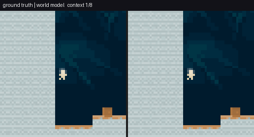

# CoinRun World Model — an action-conditioned neural game engine

A world model that learns the dynamics of the [Procgen CoinRun](https://github.com/openai/procgen) environment well enough to be **played interactively**: your key presses condition an autoregressive transformer that generates the next frame — physics, rendering, and game logic all inferred by the network.

**Trained checkpoints (VQ-VAE + transformer, ~1 GB):** [MAURYASAURABH/coinrun-world-model on Hugging Face](https://huggingface.co/MAURYASAURABH/coinrun-world-model)



*Left: the real episode. Right: the model's autoregressive rollout from 8 context frames, replaying the same action sequence — every right-hand frame after the context is generated by the network. Reproduce with `python scripts/make_demo_gif.py`.*

## How it works

Two-stage latent world model, in the spirit of world-model and neural-game-engine research:

```
64×64 RGB frame ──► VQ-VAE encoder ──► 8×8 grid of discrete tokens (codebook 512, dim 128)
                                             │
      player action (15 discrete) ──────────►│
                                             ▼
                     action-conditioned transformer (6 layers · 8 heads · width 512,
                     context 8 frames · top-k 50 / temperature 0.9 sampling)
                                             │
                                             ▼
                    next-frame tokens ──► VQ-VAE decoder ──► next 64×64 frame
```

**Data** — 250k training frames from 500 CoinRun levels, plus 25k validation and 25k test frames from *held-out level ranges* (no level leakage). Collection uses a mixed behaviour policy (50% uniform / 35% sticky / 15% platformer-biased actions) so the model sees broad action coverage, with all trajectories stored as chunked Zarr arrays.

**Training** — AMP mixed precision, AdamW (lr 3e-4, wd 0.01), config-driven via YAML with CLI overrides (see `configs/default.yaml`; `configs/mini.yaml` for a smoke-test-sized run).

## Evaluation

The eval suite (`wm evaluate` → `wm report`) measures three things that matter for interactive generation:

- **Rollout fidelity** — PSNR and SSIM at autoregressive rollout horizons 1, 2, 4, 8, 16, 32, plus an FVD-style Fréchet distance over lightweight video features.
- **Controllability** — counterfactual action tests (same context, different conditioned action) and an **inverse-dynamics probe**: a small CNN trained on real transitions, applied to generated ones, to check that the *conditioned action is actually reflected* in the generated dynamics.
- **Context sensitivity** — ablations over 1 / 4 / 8 context frames.

Metrics land in `runs/evaluate/*/metrics_summary.json` and are rendered into report + blog-post markdown by `wm report`.

### Results (bundled mini test split)

Rollout fidelity of the released checkpoints, measured on 16 clips from the 128-frame **held-out mini test split bundled in this repo** (levels 20000+, never seen in training), horizon 8, seed 123, Apple-silicon MPS:

| Rollout step | PSNR ↑ | SSIM ↑ | copy-last PSNR | copy-last SSIM |
|---:|---:|---:|---:|---:|
| 1 | 21.7 | **0.765** | 46.7 | 0.758 |
| 2 | 19.6 | 0.685 | 38.8 | **0.707** |
| 4 | 16.9 | **0.677** | 31.5 | 0.648 |
| 8 | 12.4 | 0.513 | 47.1 | **0.646** |

Honest reading of the small-scale numbers:

- The model matches the copy-last-frame baseline on SSIM at short horizons and degrades smoothly with rollout depth — the expected autoregressive drift (visible in the GIF above).
- **Copy-last is a strong PSNR baseline here** because the mini clips are low-motion; PSNR rewards copying static backgrounds. This is exactly why the eval also logs FVD-style distributional distance (4.92 on this run) and controllability probes rather than pixel metrics alone.
- **Controllability results are inconclusive at mini scale**: the inverse-dynamics probe trains on only ~500 mini-split frames and collapses to the majority action, so its generated-transition accuracy is not informative here. Measuring action-following properly needs the full 250k-frame dataset — that is the point of the counterfactual/probe machinery in the suite.

Regenerate with:

```bash
wm evaluate --config configs/default.yaml \
  vqvae.checkpoint=<vqvae.pt> transformer.checkpoint=<transformer.pt> \
  "eval.rollout_steps=[1,2,4,8]" eval.clips=16 eval.batch_size=8
```

## Quickstart

Python 3.10. Note: `procgen` does not build on Apple Silicon — data collection and training run on Linux/Windows + NVIDIA; the demo and tests run anywhere.

```bash
conda env create -f environment.yml
conda activate coinrun-wm
pip install -e .
```

The whole pipeline is one CLI (`wm`):

```bash
wm collect            --config configs/default.yaml   # 1. roll out CoinRun, store Zarr dataset
wm train-vqvae        --config configs/default.yaml   # 2. learn the visual tokenizer
wm encode             --config configs/default.yaml vqvae.checkpoint=runs/vqvae/latest.pt
wm train-transformer  --config configs/default.yaml   # 4. learn action-conditioned dynamics
wm evaluate           --config configs/default.yaml   # 5. rollout + controllability metrics
wm demo               --config configs/default.yaml   # 6. play it in the browser
wm report             --config configs/default.yaml   # 7. render metrics into reports
```

## Interactive demo

`wm demo` serves a local web UI (FastAPI + vanilla JS): arrow keys are mapped to CoinRun actions, each press is fed to the transformer, and the generated frames stream back — you are playing the model, not the game. A `Dockerfile` is included for containerised deployment. If no checkpoint is present the server runs in mock mode so the UI can be exercised end-to-end.

## Project structure

```
coinrun_world_model/
  data/            # procgen action space, Zarr dataset, collection policy
  models/          # VQ-VAE and action-conditioned transformer
  eval/            # PSNR/SSIM/FVD-style metrics, inverse-dynamics probe
  demo/            # FastAPI server + browser front-end
  cli.py           # `wm` entry point (typer)
  train_vqvae.py / train_transformer.py / encode.py / evaluate.py / report.py
configs/           # default.yaml, mini.yaml
data/procgen_coinrun_mini/   # bundled mini dataset (smoke tests, demos, CI)
scripts/           # make_demo_gif.py — renders the README rollout GIF
tests/             # dataset, models, metrics, demo, procgen smoke tests (CI: ruff + pytest)
```

## Tests

```bash
pytest            # procgen-dependent tests skip automatically where procgen is unavailable
```

## License

MIT
